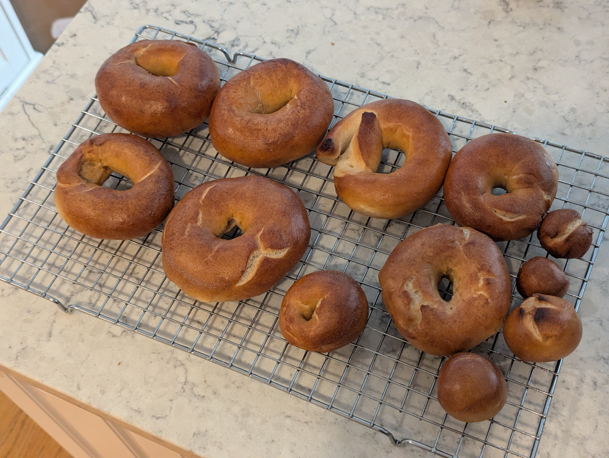

>[!IMPORTANT]
>**This post was retroactively written. For completeness of my bagel journey I tried my best to create this log entry from scattered notes well after the fact.**

We all have to start somewhere. Here is where I did.

## What I did
A standard New York style formula built around bread flour, barley malt syrup, an overnight cold ferment, and a malt water boil. 500g of flour, yielding 8 bagels. I compiled this from a variety of other recipes that I came across online.

**As weights:**
- 500 g bread flour
- 20 g barley malt syrup
- 7.5 g salt
- 4 g instant yeast
- 280 g cold water

**As baker percentages:**
- 100% bread flour
- 4% barley malt syrup
- 1.5% salt
- 0.8% instant yeast
- 56% cold water

**Boiling bath:**
- 3 L water
- 2 Tbsp barley malt syrup
- 1 Tbsp baking soda
- 1 Tbsp sugar

### Stage 1
1. Whisk flour, salt, and yeast together in mixing bowl
2. Dissolve barley malt syrup in cold water
3. Add wet ingredients to dry and mix until a shaggy dough forms
4. Knead until smooth and elastic
5. Place dough in oiled bowl and cover
6. Place into fridge for cold ferment, 12-18 hours

### Stage 2
7. Remove dough from fridge and rest 30 minutes at room temperature
8. Divide into 8 equal pieces and rest 5 minutes
9. Shape into bagels using the roll method
10. Proof at room temperature 30-60 minutes until they pass the float test
11. Preheat oven to 450F
12. Boil each bagel 45 seconds per side
13. Apply toppings immediately after boiling
14. Bake 20-25 minutes, rotating baking sheet half way through
15. Cool at least 15 minutes before slicing

## Results
These are not what I am looking for in a bagel. They had tough leather crust that wasn't fun to bite through and gave your jaw a workout in a bad way. The flavor of the crumb was also very dull and flat. Much darker in color than desired too, perhaps that is just from baking too long.

