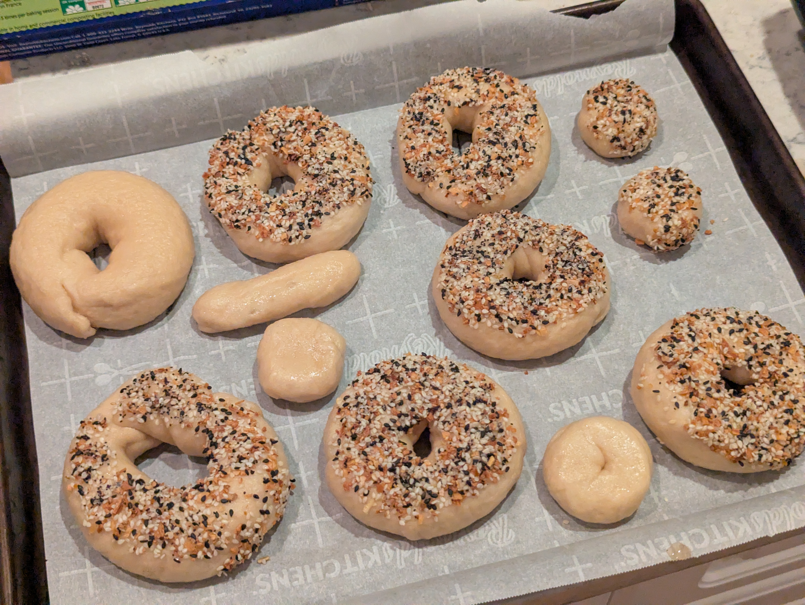
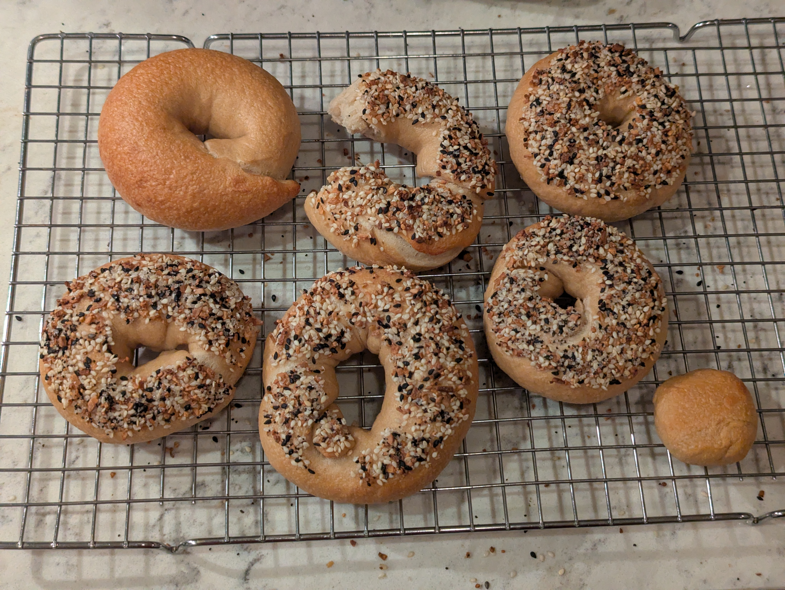

>[!IMPORTANT]
>**This post was retroactively written. For completeness of my bagel journey I tried my best to create this log entry from scattered notes well after the fact.**

The first batch wasn't a catastrophe but didn't leave me feeling successful either. Let's try a second run.

## What I did
Same formula as the first attempt except I cut out the baking soda in the boiling water and baked at a lower temperature (450F -> 425F)

**As weights:**
- 500 g bread flour
- 20 g barley malt syrup
- 7.5 g salt
- 4 g instant yeast
- 280 g cold water

**As baker percentages:**
- 100% bread flour
- 4% barley malt syrup
- 1.5% salt
- 0.8% instant yeast
- 56% cold water

**Boiling bath:**
- 3 L water
- 2 Tbsp barley malt syrup
- 1 Tbsp sugar

### Stage 1
1. Whisk flour, salt, and yeast together in mixing bowl
2. Dissolve barley malt syrup in cold water
3. Add wet ingredients to dry and mix until a shaggy dough forms
4. Knead until smooth and elastic
5. Place dough in oiled bowl and cover
6. Place into fridge for cold ferment, 12-18 hours

### Stage 2
7. Remove dough from fridge and rest 30 minutes at room temperature
8. Divide into 8 equal pieces and rest 5 minutes
9. Shape into bagels using the roll method
10. Proof at room temperature until they pass the float test
11. Preheat oven to 425F
12. Boil each bagel 45 seconds per side
13. Apply toppings immediately after boiling
14. Bake 20-25 minutes, rotating baking sheet half way through
15. Cool at least 15 minutes before slicing

## Results
Better this time around! I also bought a container of Everything mix from Costco to top some of the bagels (a bit salty but still enjoyable). I may have been too conservative with the final bake times in combination with the lower temperature as the bagels didn't form a crisp outer crust.

