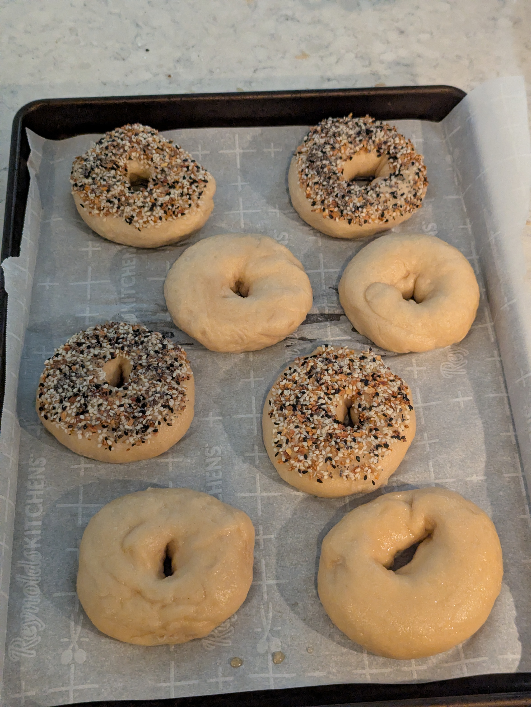
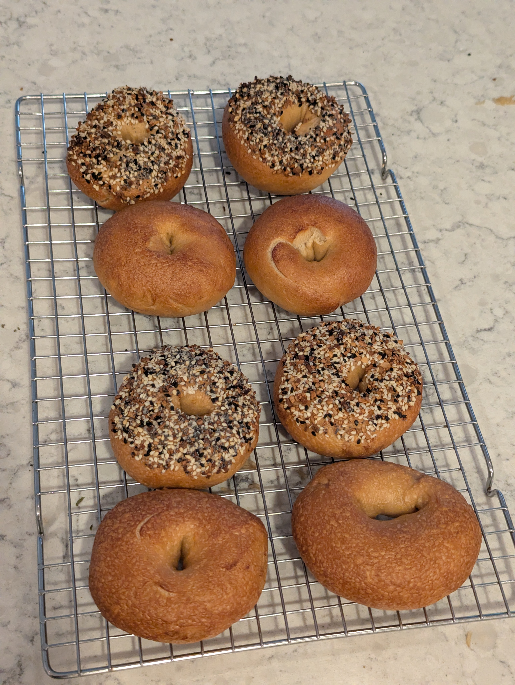

>[!IMPORTANT]
>**This post was retroactively written. For completeness of my bagel journey I tried my best to create this log entry from scattered notes well after the fact.**

Shaping cold dough straight from the fridge has been a struggle. From my research it seems like shaping before the cold ferment is more common. This takes up more fridge space so I have been resistant to wanting to go that route. But shaping the cold dough with lots of gluten development is difficult and sealing the seams during rolling is a bear. This batch was split to compare shaping fresh dough before the cold ferment against the traditional shape-after approach.

## What I did
One dough, divided in half after kneading. Half was shaped immediately and cold fermented in final shape. Half was cold fermented as a bulk mass and shaped the next day.

**As weights:**
- 500 g bread flour
- 20 g barley malt syrup
- 7.5 g salt
- 4 g instant yeast
- 280 g cold water

**As baker percentages:**
- 100% bread flour
- 4% barley malt syrup
- 1.5% salt
- 0.8% instant yeast
- 56% cold water

### Stage 1
1. Whisk flour, salt, and yeast together in mixing bowl
2. Dissolve barley malt syrup in cold water
3. Add wet ingredients to dry and mix until a shaggy dough forms
4. Knead until smooth and elastic
5. Divide dough in half
6. **Batch A:** divide into pieces, rest 5 minutes, shape into bagels, place on lined tray
7. **Batch B:** form into a ball and place in oiled bowl
8. Cover both and place into fridge for cold ferment

### Stage 2
9. Remove both from fridge
10. **Batch B:** rest 30 minutes at room temperature, then divide, rest 5 minutes, and shape
11. **Batch A:** rest briefly to take the chill off
12. Proof both until they pass the float test
13. Preheat oven to 450F
14. Boil each bagel 45 seconds per side
15. Bake 20-25 minutes, rotating baking sheet half way through

## Results
Markedly easier to shape the bagels before the cold ferment - the dough was tackier and softer. Debatable if it made much of an end difference in the quality of the seams.

During shaping I had also tried out another variable of the roll method vs the ball poke method. The ball poke method is easier but perhaps slower for larger batch production since the twirling steps to enlarge the inner hole takes a while - if you rush it you risk tearing the dough. Very subjective, but it seems like the rolled bagels yielded a denser crumb. The rolling method may have made for a greater tension in the gluten network.

I think this is something that I need to test out again once I have a more stable base dough recipe.

