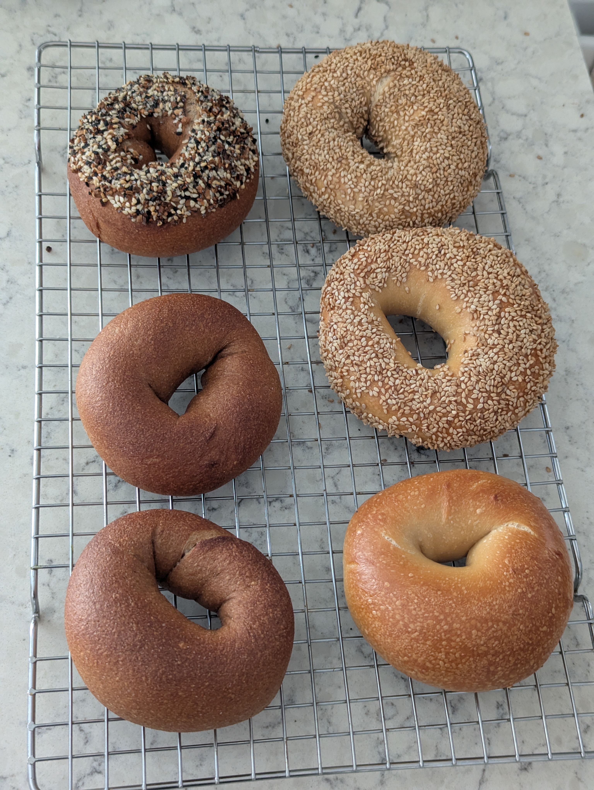

>[!IMPORTANT]
>**This post was retroactively written. For completeness of my bagel journey I tried my best to create this log entry from scattered notes well after the fact.**

"Whole wheat" is a somewhat common bagel option at bakeries but from what I can tell they are never entirely whole wheat. That the amount of whole wheat flour compared to total flour may be as little as 20%. This makes the "flavor" of the whole wheat be there but doesn't make a meaningful difference in the healthfulness of the bagel. Here I wanted to try and create a near 100% whole wheat bagel.

However, whole wheat is not a straight swap for bread flour. Whole wheat flour doesn't have the same gluten-forming potential as white flour, so this recipe leans hard on vital wheat gluten to compensate.

## What I did
Built around 500g total flour weight, targeting roughly 15% protein to offset both the lower effective gluten content and the ongoing bran interference during kneading. Hydration is much higher than a white flour bagel because bran absorbs water aggressively and competes with the gluten proteins for it.

**As weights:**
- 460 g whole wheat flour
- 40 g vital wheat gluten
- 320 g cold water
- 20 g barley malt syrup
- 7.5 g salt
- 3 g instant yeast

**As baker percentages:**
- 92% whole wheat flour
- 8% vital wheat gluten
- 64% cold water
- 4% barley malt syrup
- 1.5% salt
- 0.6% instant yeast

**Boiling bath:**
- 3 L water
- 2 Tbsp barley malt syrup
- 1 Tbsp sugar

### Stage 1
1. Whisk whole wheat flour and vital wheat gluten together in mixing bowl
2. Add cold water only and stir until a rough dough forms
3. Autolyse 20-30 minutes covered
4. Add barley malt syrup, salt, and yeast and work in by hand
5. Knead 15-18 minutes, longer than white flour dough, until the dough passes a window test
6. Divide and rest 5 minutes
7. Shape into bagels
8. Place into fridge for cold ferment, 10-14 hours

### Stage 2
9. Remove bagels from fridge and let come to room temperature
10. Float test
11. Preheat oven to 410-430F, lower than white flour bagels since bran darkens quickly
12. Boil each bagel 60 seconds per side
13. Apply toppings immediately after boiling
14. Bake 22-28 minutes, rotating baking sheet half way through
15. Cool at least 15 minutes before slicing

## Results
It worked! I was nervous about the idea of adding the vital wheat gluten but in the end these were bagels in every sense. They had a similar density and chew like any other batch I've yet made, though perhaps a bit drier at least by subjective taste.

Being 92% whole wheat made for a very strong wheat flavor profile. Not bad by any means, but certainly has to be what you want to eat. The wheat flavor even seemed to overpower the cream cheese (unless of course you pile it obscenely high ;))

