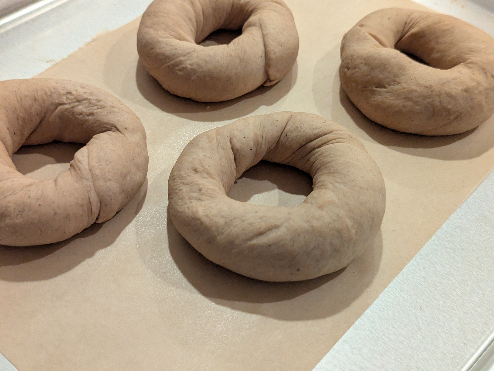
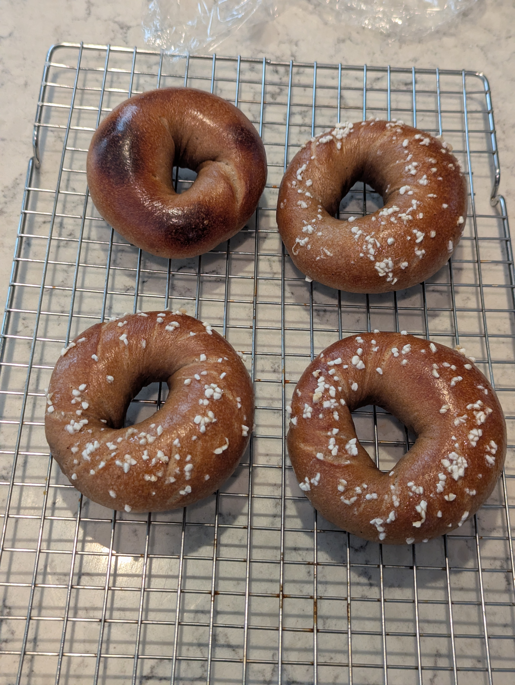

A common sight - bananas that are too far gone to stomach eating directly. The only proper fate for them now is to be made into a baked good. Why not bagels?

## What I did
The recipe below is for an equivalent of ~350g flour bagel batch which is the smallest that my KitchenAid mixer with a dough hook seems to be able to still mix and knead effectively. The inclusion of bananas is accounted for in the recipe in two ways: first for the solids that displace some of the flour content and second for the liquid that displaces water content. The end goal being a 54% hydration dough. The vital wheat gluten amount was determined by aiming for a ~15% gluten content of the flour (starting from 12.7% King Arther bread flour).

**As weights:**
- 283 g bread flour
- 22 g vital wheat gluten
- 3.5 g ground cinnamon
- 1.1 g ground nutmeg
- 150 g ripe banana (about 1.25 large peeled bananas)
- 10.5 g dark brown sugar
- 5.25 g salt
- 1.75 g vanilla extract
- 76.5 g cold water
- 2.3 g instant yeast

**As baker percentages:**
- 80.9% bread flour
- 6.2% vital wheat gluten
- 1% ground cinnamon
- 0.3% ground nutmeg
- 12.9% ripe banana solids (about 1.25 large peeled bananas)
- 32.1% ripe banana liquids
- 3% dark brown sugar
- 0.65% instant yeast
- 1.5% salt
- 0.5% vanilla extract
- 21.9% cold water

### Stage 1
1. Mix flour, wheat gluten, and spices in mixing bowl
2. Blend banana, sugar, salt, vanilla extract, and water
3. Add wet ingredients to dry and mix until just combined
4. Add instant yeast by sprinkling over roughly formed dough
5. Knead dough
6. Divide dough to 130g balls and let rest 5 minutes
7. Shape dough balls into bagels
8. Place into fridge for cold ferment, 12-16 hours

### Stage 2
9. Remove bagels from fridge so they can get to room temperature
10. Preheat oven to 450F
11. Create water bath with 1 quart of water with 2 Tbsp of brown sugar
12. Boil each bagel 30 seconds per side and place on parchment lined baking sheet
13. (Optional) Sprinkle with pearl sugar
14. Bake for 20 minutes, rotating baking sheet half way through

## How it went
The dough came together well and smelled great throughout the mix and kneading. Bagels also shaped well, but I think the low hydration did make sealing the ends of the bagels difficult.

I took the bagels out of the fridge after around 13 hours of cold fermentation and they did not look like they had proofed at all. I let them get to room temperature before performing a float test and they did not pass. I let the bagels sit out for close to 2 hours outside of the fridge hoping for some proofing to occur but saw very little change and they never did pass the float test. This was disappointing since this was an experimental batch coming right after my last failure with the buffalo bagels not rising either.

I still went through with the boil and bake process though.

## Results

Surprisingly the were not as flat and dense as I expected them to be. Certaily still underproofed, but there was some yeast activity after all. They formed a nice crust and while the crumb was denser than desired they tasted really good. A not-so-sweet banana bread flavor. The bagels paired really well with a maple butter I had on hand.

## What I'd change next time
- A tad less nutmeg
- Measure the ph of the bagel dough as the ripe bananas may have made it too acidic for the yeast to thrive. If too low then I can try adding in baking soda to balance the ph before adding the yeast.
	- Perhaps they just needed more time to proof. I think for my experimental recipes I may be better off letting the dough bulk proof at room temperature after kneading to ensure yeast activity and then shape and cold ferment after. My understanding is that this will lead to less flavor development from the yeast throughout the cold ferment but it will at least save me from worry about inactive yeast.