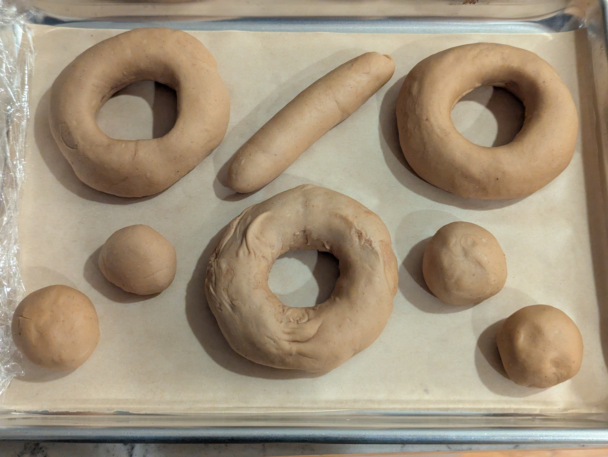
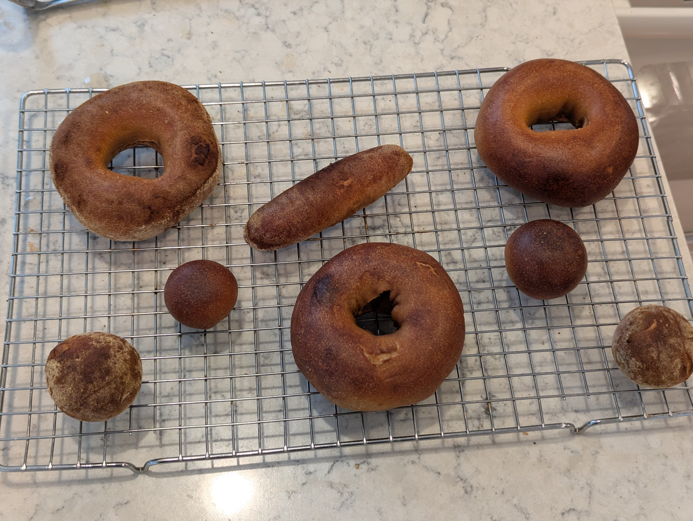

>[!IMPORTANT]
>**This post was retroactively written. For completeness of my bagel journey I tried my best to create this log entry from scattered notes well after the fact.**

The first peanut attempt did not deliver enough peanut flavor, so the obvious move was more peanut flour. This batch went from 20% to 28% and switched from plain defatted peanut flour to PB Fit Classic, which carries some added sugar and salt.

## What I did
28% PB Fit substitution. Since PB Fit contributes no gluten protein at all, the vital wheat gluten was raised significantly to compensate. The agave was reduced because PB Fit brings its own sugar, and the salt was reduced to account for the sodium in the powder.

**As weights:**
- 219 g bread flour
- 98 g PB Fit Classic
- 33 g vital wheat gluten
- 7 g agave nectar
- 3.8 g salt
- 2.1 g instant yeast
- 187 g cold water (plus 17 g extra added during mixing)

**As baker percentages:**
- 62.6% bread flour
- 28% PB Fit Classic
- 9.4% vital wheat gluten
- 2% agave nectar
- 1.1% salt
- 0.6% instant yeast
- 53.5% cold water

### Stage 1
1. Whisk bread flour, PB Fit, and vital wheat gluten together
2. Combine water and agave
3. Add wet to dry and mix until combined
4. Add instant yeast
5. Knead
6. Divide and rest 5 minutes
7. Shape into bagels
8. Proof at room temperature 30 minutes
9. Place into fridge for cold ferment, 12 hours

### Stage 2
10. Remove bagels from fridge and let come to room temperature
11. Float test
12. Preheat oven to 450F
13. Boil each bagel
14. Coat some bagels in a dry mix of PB Fit powder and coconut sugar
15. Bake 6 minutes on bagel boards
16. Flip and bake 9 minutes
17. Rotate baking sheet and bake another 8 minutes

## How it went
The dough seemed fairly dry when shaping, so an extra 17 g of water went in during mixing.

The room temperature proof was only 30 minutes before going into the fridge, which was shorter than intended. After 12 hours in the fridge it took around 4 hours out of the fridge before the bagels passed the float test.

The brown color of the dough made it hard to judge doneness. They went a little long but were not burnt.

## Results
Less peanut flavor came through than the first attempt. The end result tasted more like a whole wheat bagel than a peanut butter bagel.

The coating of PB Fit powder and coconut sugar applied after boiling worked well and gave a nice sweet peanut flavor on the exterior. That was the most successful part of the batch. The surfaces that sat on the bagel boards did not turn out well though, since the coating stuck to the boards.

## What I'd change next time
- Defatted peanut flour delivers peanut substance but not peanut aroma, since the compounds that read as peanut butter are fat soluble and leave with the pressed oil. Adding fat back is likely necessary
- Reduce PB Fit percentage and add real peanut butter and coarsely ground roasted peanuts instead
- Toast the PB Fit before use to develop fresh roasted flavor
- Brush with roasted peanut oil straight out of the oven
- Increase yeast for a 12 hour cold ferment and give a longer room temperature proof before refrigerating
- Judge doneness by internal temperature rather than color
