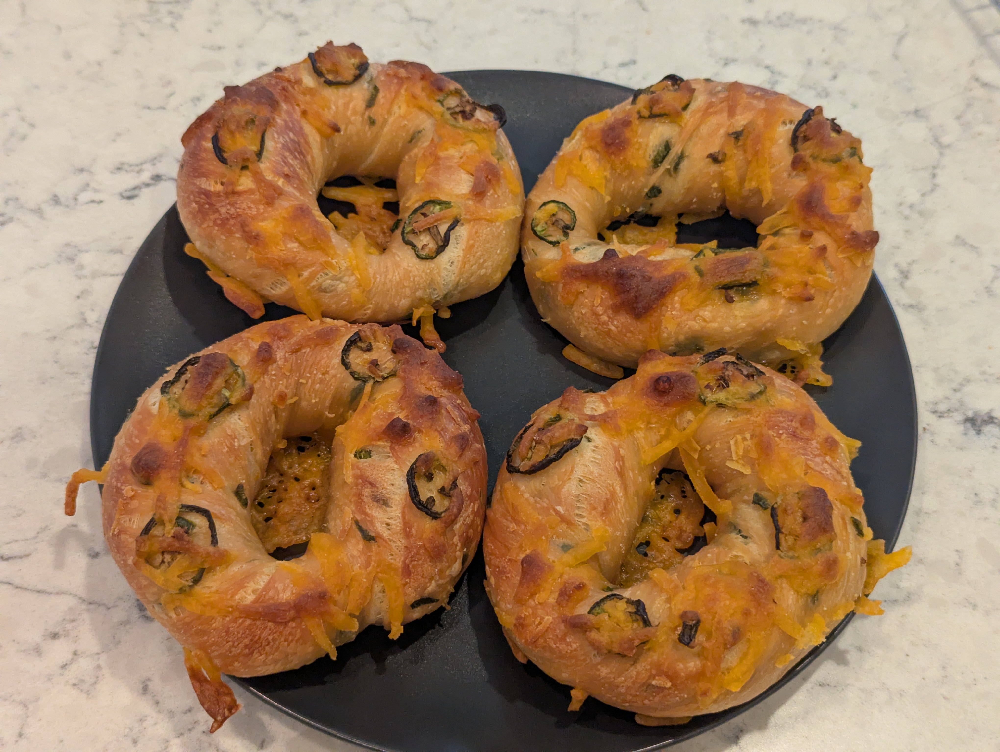

>[!IMPORTANT]
>**This post was retroactively written. For completeness of my bagel journey I tried my best to create this log entry from scattered notes well after the fact.**

Cheddar jalapeno is a standard at most bagel shops. Vegan cheddar exists, so it seems like it should be a standard in my bagel regiment too.

## What I did
The base plain dough with jalapeno and Violife shredded cheddar folded in at the end of kneading, plus more of both on top after boiling.

**As weights:**
- 342.5 g bread flour
- 7.5 g vital wheat gluten
- 17.5 g barley malt syrup
- 5.25 g salt
- 1.4 g instant yeast
- 185.5 g cold water
- 40 g jalapeno
- 55 g Violife shredded cheddar cheese

**As baker percentages:**
- 97.87% bread flour
- 2.13% vital wheat gluten
- 5% barley malt syrup
- 1.5% salt
- 0.4% instant yeast
- 53% cold water
- 11.4% jalapeno
- 15.7% Violife shredded cheddar

### Stage 1
1. Whisk bread flour and vital wheat gluten together
2. Dissolve barley malt syrup in cold water
3. Add wet to dry and mix until a shaggy dough forms
4. Add salt and yeast
5. Knead until the dough passes a window test
6. Add jalapeno and shredded cheese in the last 2 minutes of kneading
7. Divide and rest 5 minutes
8. Shape into bagels
9. Place into fridge for cold ferment, roughly 36 hours

### Stage 2
10. Remove bagels from fridge and let come to room temperature
11. Float test
12. Preheat oven to 450F
13. Boil each bagel 30 seconds per side
14. Place on parchment lined baking sheet and top with jalapeno slices and shredded cheese
15. Bake 25 minutes, then an additional 5 minutes

## How it went
Mixing in the jalapenos was difficult. Their wet surface made them readily slip and fall out of the dough. It took a fair bit of kneading to get a majority of them firmly integrated into the dough.

The bagels were in the fridge for roughly 36 hours. After coming to room temperature they just barely passed the float test in warm water, so they probably could have used more proofing time.

They were baked for 25 minutes, taken out, and sat for a couple of minutes before I decided they had not baked long enough. Back in for probably another 5 minutes.

## Results
They turned out well. The flavor was great.

The cheese that overflowed and fell to the sides of the bagels was not a problem at all. It melted and made for nice crispy bits that stayed attached.

The crumb was perhaps a bit dense, consistent with the marginal float test. There was also probably more cheese incorporated into the dough than necessary.

## What I'd change next time
- Reduce the amount of cheese mixed into the dough, since the cheese on the outside is doing most of the work
- Give more proofing time before boiling
- Consider dropping the oven temperature, since cheese browns faster than dough
- Pat dry the jalapenos before adding into the dough, or maybe  short run in the dehydrator to get them to have a dry outer skin
