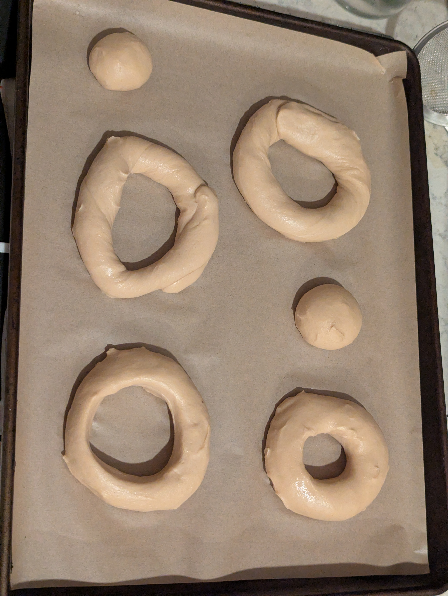
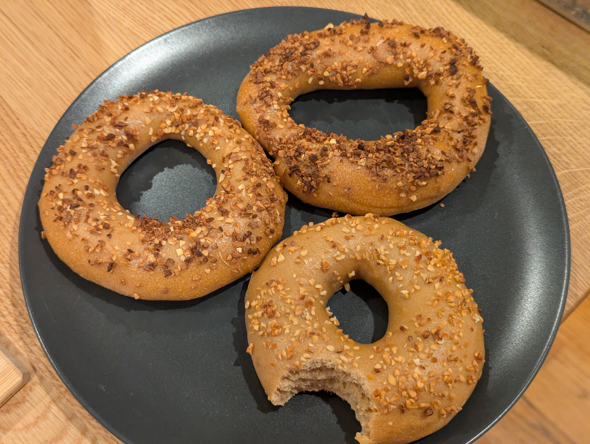
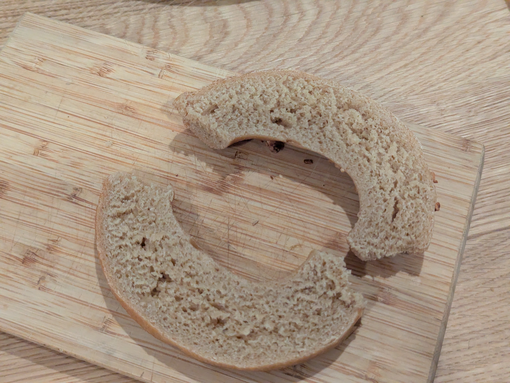

>[!IMPORTANT]
>**This post was retroactively written. For completeness of my bagel journey I tried my best to create this log entry from scattered notes well after the fact.**

The goal was a garlic bagel that is actually garlic all the way through, not a plain bagel with garlic sprinkled on top. Raw garlic is a problem for yeast because allicin is genuinely antimicrobial, but roasting destroys allicin entirely, so roasted garlic paste seemed like a safe way to get garlic into the dough.

## What I did
Roasted garlic paste worked into the dough, with dried minced garlic on top in several variations to test scorching.

**As weights:**
- 343 g bread flour
- 7 g vital wheat gluten
- 17.5 g barley malt syrup
- 5.3 g salt
- 2.2 g instant yeast
- 168.5 g cold water
- 40 g roasted garlic paste

**As baker percentages:**
- 97.87% bread flour
- 2.13% vital wheat gluten
- 5% barley malt syrup
- 1.5% salt
- 0.64% instant yeast
- 40 g roasted garlic paste

Target total hydration was 56%, assuming 60% water content in the roasted garlic.

### Stage 1
1. Whisk bread flour and vital wheat gluten together
2. Dissolve barley malt syrup in cold water
3. Add wet to dry and mix until combined
4. Add salt and yeast
5. Add roasted garlic paste
6. Knead
7. Chill dough briefly to firm it up enough to handle
8. Divide and rest
9. Shape into bagels using the poke method
10. Place into fridge for cold ferment, roughly 22 hours

### Stage 2
11. Remove bagels from fridge and let come to room temperature
12. Float test
13. Preheat oven to 450F
14. Boil each bagel
15. Top with dried minced garlic
16. Bake 24 minutes

## How it went
The dough ended up being very sticky and was very difficult to work with. Apparently this may have come from protease enzymes in the garlic breaking down the gluten protein chains. It required time in the fridge before shaping just to be firm enough to handle, and even then only the poke method worked. The shaped bagels flattened out as the dough relaxed too.

After roughly 22 hours in the fridge they just barely passed the float test after 30 minutes at room temperature.

## Results
They tasted like garlic, more in line with a sweet roasted garlic flavor, which is what the roasted paste would be expected to give. The dough itself had a nice subtle level of garlic but the toppings on the outside are what really sealed the deal.

With Violife cream cheese it had a classic garlic bread vibe.

Four topping variations were tested to work out the scorching problem:

- Dry minced garlic, uncovered: scorched the most
- Dry minced garlic with an aluminum tent for the last 10 minutes: turned out okay
- Rehydrated minced garlic, uncovered: started scorching but less than dry
- Rehydrated minced garlic with an aluminum tent: did not scorch but also did not toast much

The two with aluminum tents had noticeably softer crusts in an unsatisfying way. They never reached the hard cracking crust stage that the uncovered ones did.

## What I'd change next time
- Add the roasted garlic paste at the end of kneading rather than at the start, so any surviving proteases have less contact time with a developed gluten network
- Roast the garlic longer and hotter to fully deactivate the enzymes
- Drop the oven temp to prevent scorching of the garlic toppings
