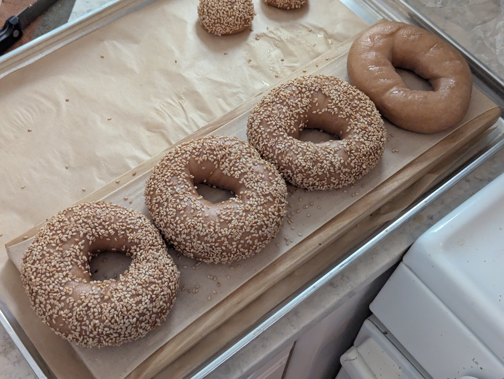
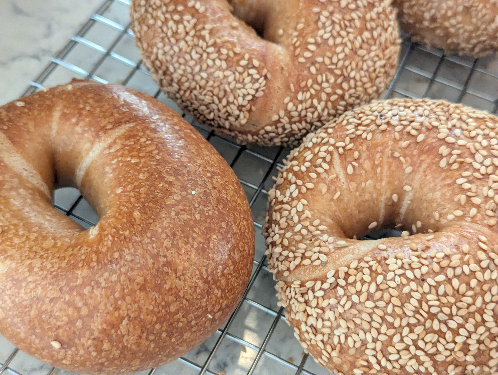
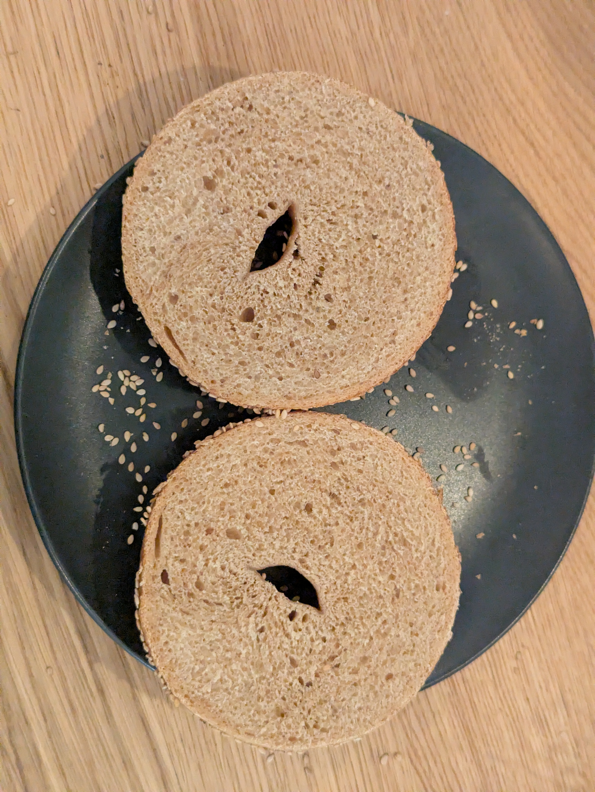

In one of my earlier bagel trials I made sesame bagels with toasted sesame oil in the dough which I enjoyed a lot. I also wanted to give whole wheat another shot but taming down the whole wheat to a lower portion of the flour.

## What I did
30% whole wheat with vital wheat gluten raised to offset both the bran's interference with gluten development and the shortening effect of the sesame oil. Hydration raised because bran absorbs water aggressively and competes with the gluten proteins for it.

**As weights:**
- 231 g bread flour
- 105 g whole wheat flour
- 14 g vital wheat gluten
- 14 g toasted sesame oil
- 17.5 g barley malt syrup
- 5.3 g salt
- 1.6 g instant yeast
- 197 g cold water

**As baker percentages:**
- 66% bread flour
- 30% whole wheat flour
- 4% vital wheat gluten
- 4% toasted sesame oil
- 5% barley malt syrup
- 1.5% salt
- 0.45% instant yeast
- 56.3% cold water

### Stage 1
1. Whisk bread flour, whole wheat flour, and vital wheat gluten together
2. Add cold water only and mix until a rough dough forms
3. Autolyse 30 minutes covered
4. Add sesame oil, barley malt syrup, salt, and yeast and work in
5. Knead 16-18 minutes until the dough passes a window test
6. Divide and rest 5 minutes
7. Shape into bagels
8. Place into fridge for cold ferment, roughly 36 hours

### Stage 2
9. Remove bagels from fridge and let come to room temperature
10. Float test
11. Preheat oven to 425F, lower than usual since bran darkens quickly
12. Boil each bagel
13. Press lightly toasted sesame seeds onto the wet surface immediately after boiling
14. Bake, rotating baking sheet half way through

## How it went
No notable issues in the making process

## Results
The whole wheat flavor dominated. This was a surprise given that it was only 30% whole wheat flour. The sesame oil flavor didn't come through at all. It felt like the sesame seeds on the outside of the bagel had to do a lot of heavy lifting to get any sesame flavor coming over the whole wheat.

Good bagels by all other metrics though!

## What I'd change next time
- I think this has told me that whole wheat is its own flavor and needs to be given its own space. While it is admirable to try and keep as much nutrients in the flour of a bagel as possible, you really have to be set on wanting that whole wheat flavor
