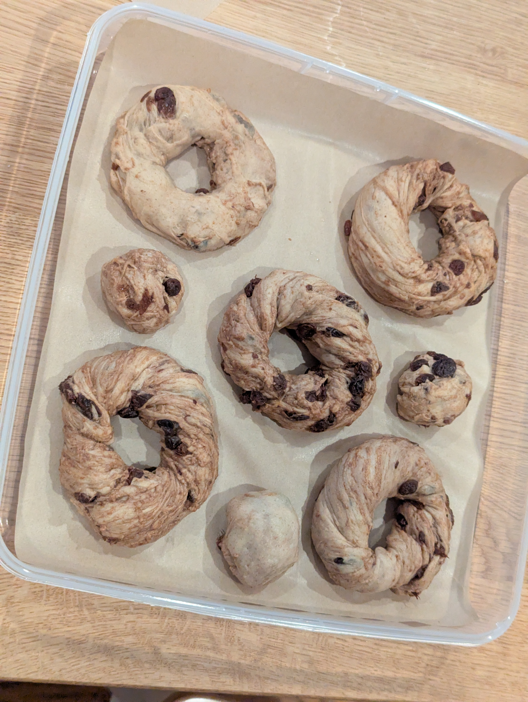
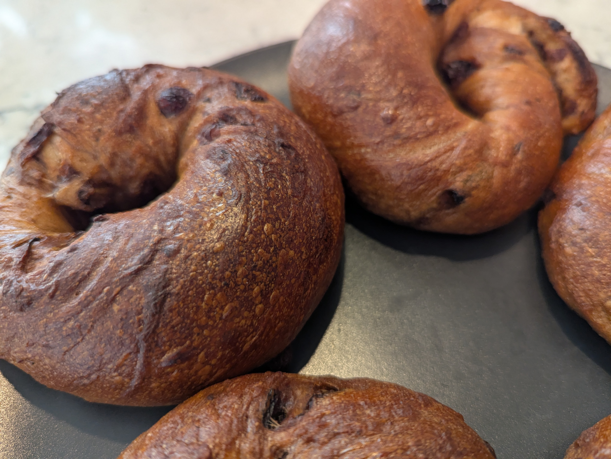
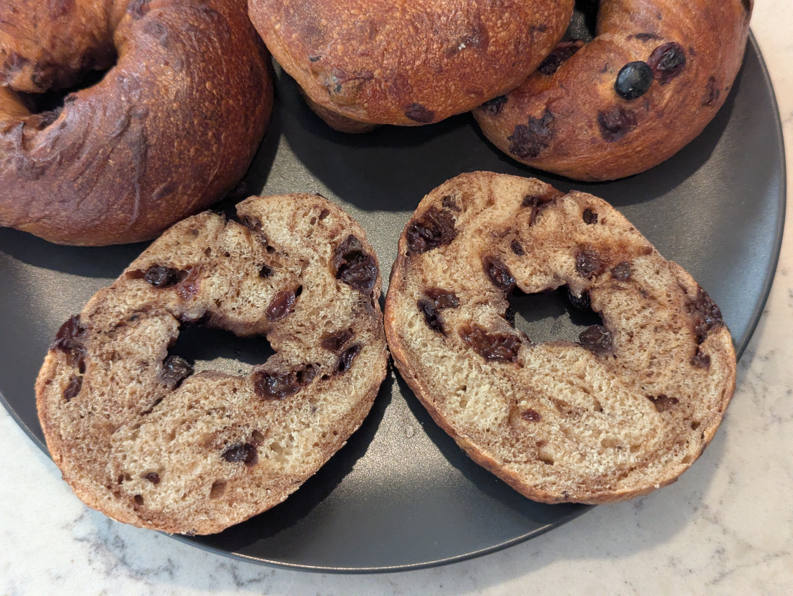

I haven't dipped my toes into the traditional sweeter bagel realm yet. Cinnamon raisin seemed as good as any flavor to try. It doesn't hurt that I have a surplus of raisins sitting in my pantry because of a miscommunication when shopping at Costco one day.

## What I did
Built off my standard 400 g flour weight dough, targeting 15% gluten protein and an 18 hour cold ferment.
 
Two changes from the plain recipe. First, the barley malt syrup came out of the dough and was replaced with dark brown sugar. What malt contributes to the crumb is a savory, slightly bitter maltose note that works against a cinnamon raisin profile. Brown sugar gives caramel depth instead. The malt syrup stays in the bath to handle the browning.
 
Second, the cinnamon is split between the dough and a swirl. A low dose in the dough gives background warmth in every bite, and the swirl gives concentrated hits. The dough dose is kept low on purpose, since cinnamon has some antimicrobial properties and I didn't want to fight the yeast with it.
 
The raisins are added in at the very end after all of kneading for gluten development has already occurred.
 
**As weights:**
- 385 g bread flour
- 15 g vital wheat gluten
- 20 g dark brown sugar
- 3 g ground cinnamon
- 6 g salt
- 3.3 g instant yeast
- 224 g cold water
- 90 g raisins, soaked 10 minutes in warm water and drained

Swirl filling:
- 24 g dark brown sugar
- 7 g ground cinnamon
- Tiny splash of water, just enough until formed a paste

**As baker percentages:**
- 96.17% bread flour
- 3.83% vital wheat gluten
- 5% dark brown sugar
- 0.75% ground cinnamon
- 1.5% salt
- 0.82% instant yeast
- 56% cold water

**Boiling bath:**
- 1 L water to 1 Tbsp barley malt syrup
## How it went
Adding in the raisins and the cinnamon sugar paste was a nightmare. I needed to pat dry the raisins instead of just thinking that they would drain dry well enough. The extra water from the raisins made the dough wet and they didn't want to stay in well (similar to what I observed in the jalapenos from the jalapeno cheddar batch). I eventually got the raisins mixed in enough to my liking and then I tried the cinnamon sugar paste. Adding the water to turn it into a paste was a huge mistake. It made the dough even wetter and stickier, now with the added nuisance of the brown sugar. It was very difficult to incorporate and what I thought would be a simple task of swirling the dough turned into a battle of needing to knead the inclusions more thoroughly throughout. As I mixed the cinnamon sugar paste seemed to create layers that kept the gluten network from reforming. This lead to a wet shaggy dough. This made dividing and shaping into bagels very difficult but I powered through anyway. I was still determined to get these bagels baked to know how the flavor would come out.

The bagels did not proof well.
 
After 18 hours in the fridge there was no observable expansion. I let them sit out and after an hour at room temperature they still did not pass the float test and still showed no visible change.
 
To rule out the shaped bagels being the problem, I submerged a test dough ball in warm water. It did not expand or begin to float either. Warm water should have accelerated things noticeably within that window if the yeast were only suppressed rather than inactive, so this looked like a stall rather than a slow ferment.
 
## Results
Despite all of the struggles that were brought on by the raisin and cinnamon sugar inclusions, the bagels still turned out well. During baking they did manage to have a fair bit of oven spring and didn't end up being too dense like I suspected they would given that they didn't pass the float test. My hunch is that the shaggy gluten network didn't support a large network of air pockets and the raisins made the bagels a bit denser than plain ones would have been. 

Cutting into them revealed a pleasant swirl pattern that I was aiming for!

 
## What I'd change next time
The two candidate explanations are cinnamon suppression and dead yeast, and I don't have enough information to separate them yet.
 
I thought 0.75% in the dough should be below the threshold where suppression of the cinnamon becomes a real problem for the yeast. Two things could have pushed the effective dose higher than intended. I used Cassia cinnamon which apparently has a higher cinnamaldehyde content than other varieties like Ceylon. And if the swirl filling smeared during mixing rather than staying as a clean swirl so cinnamon that was supposed to be isolated in the swirl would have ended up distributed through the dough. The swirl is 1.75% of flour weight on its own, so that would matter.
 
- Use Ceylon cinnamon in the dough if I have it, and save the cassia for the swirl where it can't interfere with fermentation
- Consider dropping the dough cinnamon to 0.5% or moving it entirely into the swirl
- Keep the cinnamon sugar swirl addition dry
- Pat dry raisins or perhaps through them into the oven or dehydrator briefly so they form dry skins again while still keeping the insides rehydrated