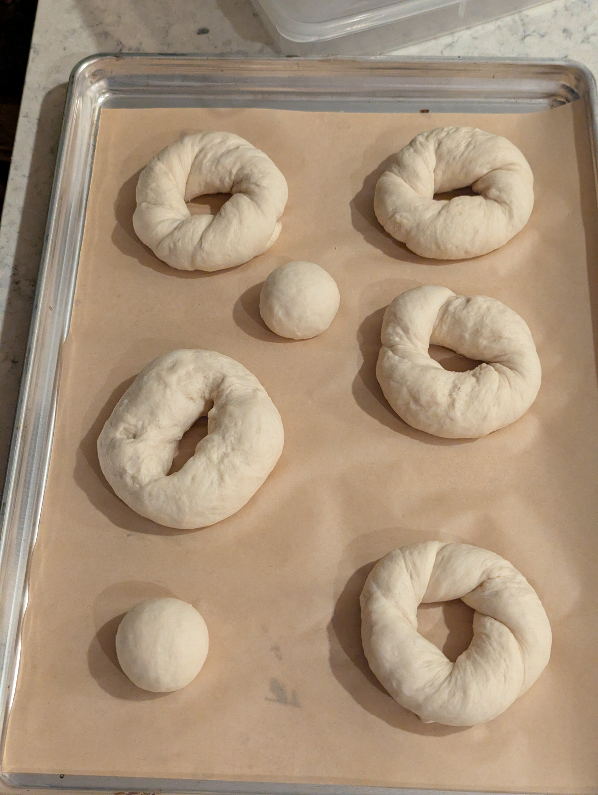
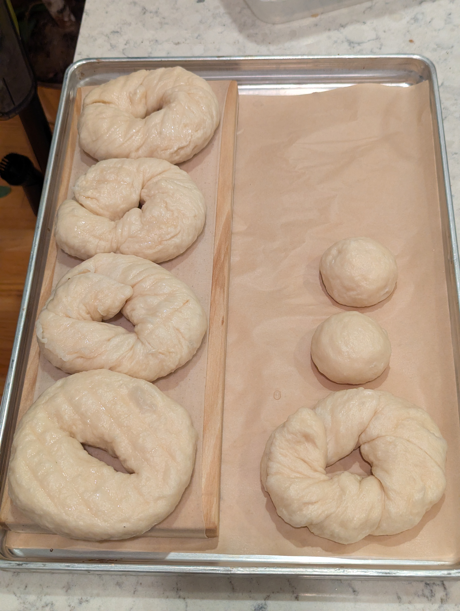
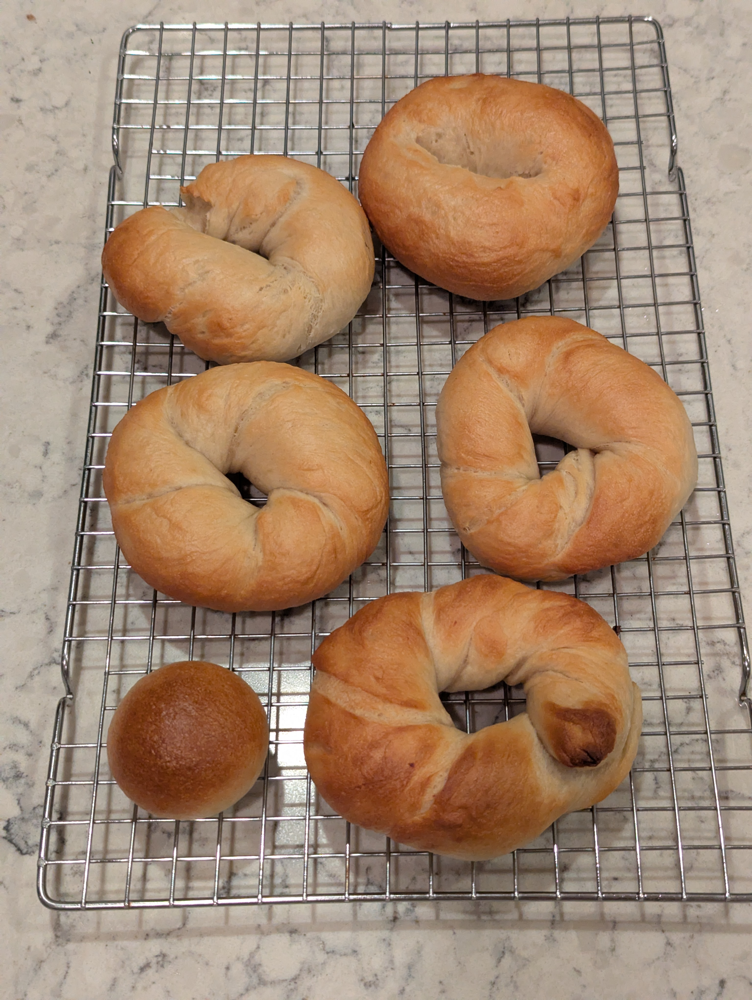

Everything I've been doing so far has had the goal of creating a dense and chewy New York style bagel. I wanted to test whether that's actually a preference or just a path I incorrectly started down. So this batch reverses every lever deliberately - soft instead of chewy, neutral and slightly sweet instead of letting yeast develop a complex flavor, and start to finish in a little over two hours instead of multiple days.

## What I did
Every choice here is the inverse of my usual approach.

Protein goes down rather than up. Hydration goes up. Yeast goes way up to get speed at the cost of flavor. Fat and sugar both go in. The malt syrup comes out entirely. And the boil is short.

**As weights:**
- 400 g all-purpose flour
- 238 g warm water
- 28 g granulated sugar
- 21 g neutral oil
- 7 g instant yeast
- 5.3 g salt

**As baker percentages:**
- 100% all-purpose flour
- 59.5% warm water
- 7% granulated sugar
- 5.2% neutral oil
- 1.8% instant yeast
- 1.3% salt

**Boiling bath:**
- 1 L water
- 1 Tbsp sugar

### Stage 1
1. Whisk flour, sugar, salt, and yeast together
2. Combine warm water and oil, add to dry, and mix until a shaggy dough forms
3. Knead 8-10 minutes only, stopping as soon as it's smooth
4. Cover and bulk proof 45 minutes at room temperature until roughly doubled

### Stage 2
5. Divide into 6 pieces and rest 5 minutes
6. Shape into bagels using the roll method
7. Proof 35-45 minutes covered, until visibly puffy and the dough springs back slowly when poked
8. Preheat oven to 450F
9. Boil each bagel 15-30 seconds per side
10. Bake 20-25 minutes, rotating baking sheet half way through
11. Cool 10 minutes

## How it went
The bulk proof is back, which fell out of favor in my recent bagel bakes. At nearly 2% yeast in a warm kitchen it does real work in 45 minutes and is where a lot of the volume comes from.

Total time was a little over two hours, which is a genuinely different experience from planning a bake two days out.

Shaping the bagels was interesting as the bulk ferment led to a lot of gas being trapped inside the dough already. When rolling out the ropes there would be large air bubbles that I'd have to work around or pop.

I had thought the higher hydration and lower gluten content of the dough would have made shaping and sealing easier but it was actually the opposite. It was harder to evenly roll out the ropes and was easier to squish and misshape during even the simplest handling tasks like setting the dough onto its baking sheet.

## Results
As expected (and desired for this one batch) the bagels were soft and their flavor was slightly sweet. I would say these were like bagel shaped bread rolls. The boil and bake process still gave them the signature bagel crust chew but the inside didn't have any of the crumb chew that I have come to know a bagel as having.

It wasn't as fluffy as I thought they would be given the higher hydration. I am thinking that the high oil content which made the crumb soft also meant a shorter gluten network that couldn't trap gas in the same way that would have yielded large air pockets that a fluffy bake would have needed.

## What I'd change next time
- I won't be bothering with this another time, as there are not the types of bagels I am after but it could be interesting to try and create a same-day bagel recipe that tries to get as much of the dense, chewy, and complex flavored New York style bagel experience as possible.