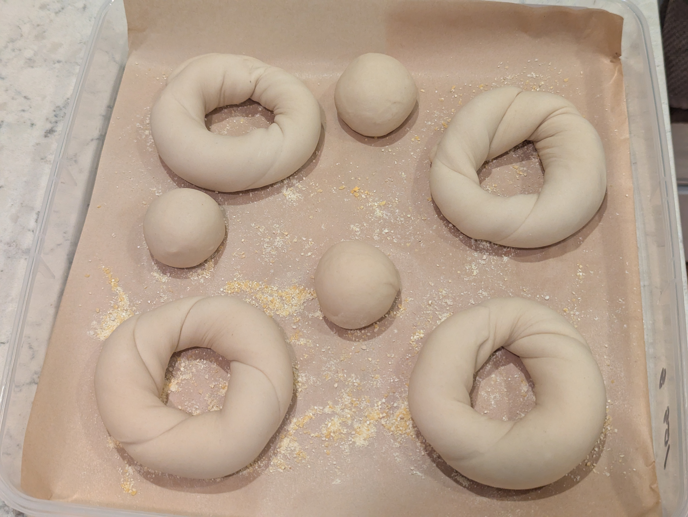
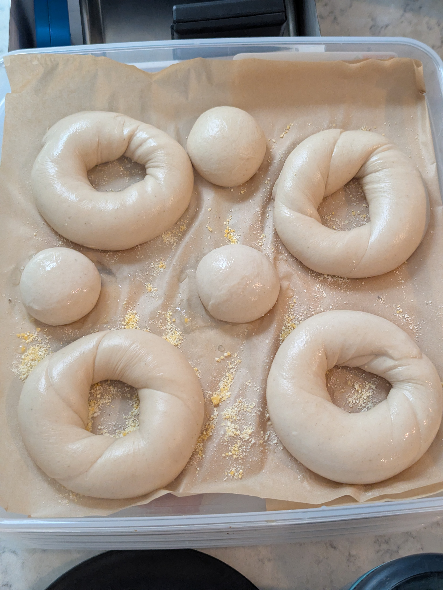
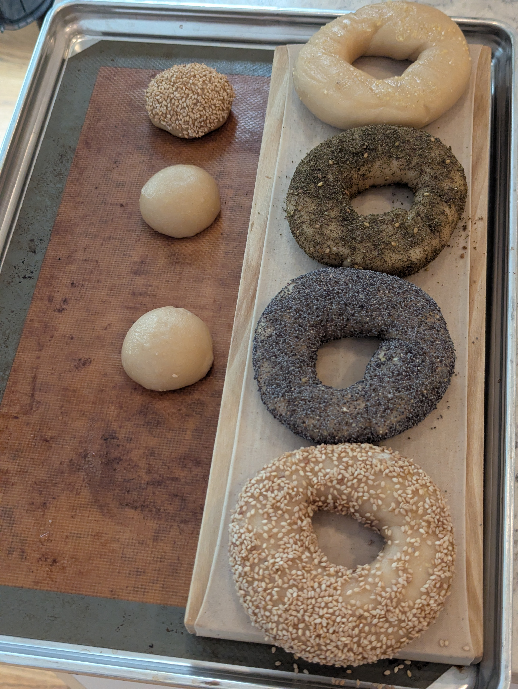
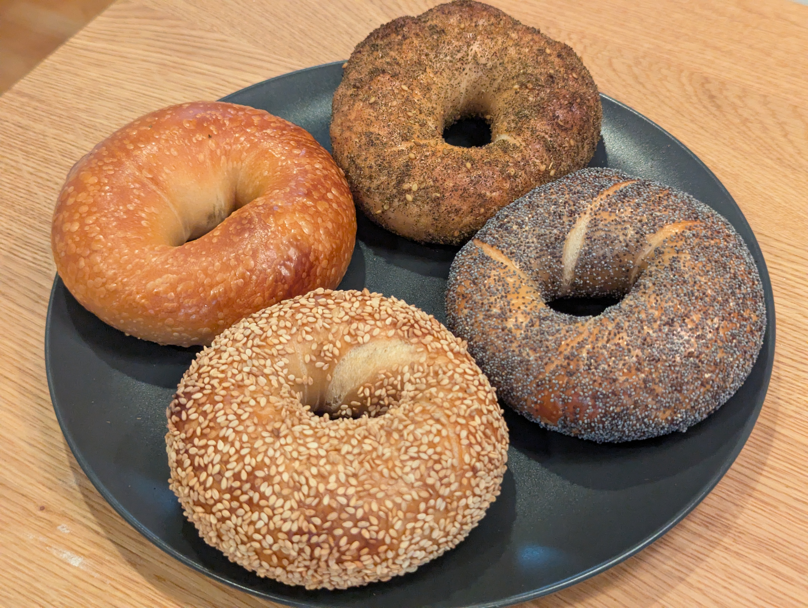
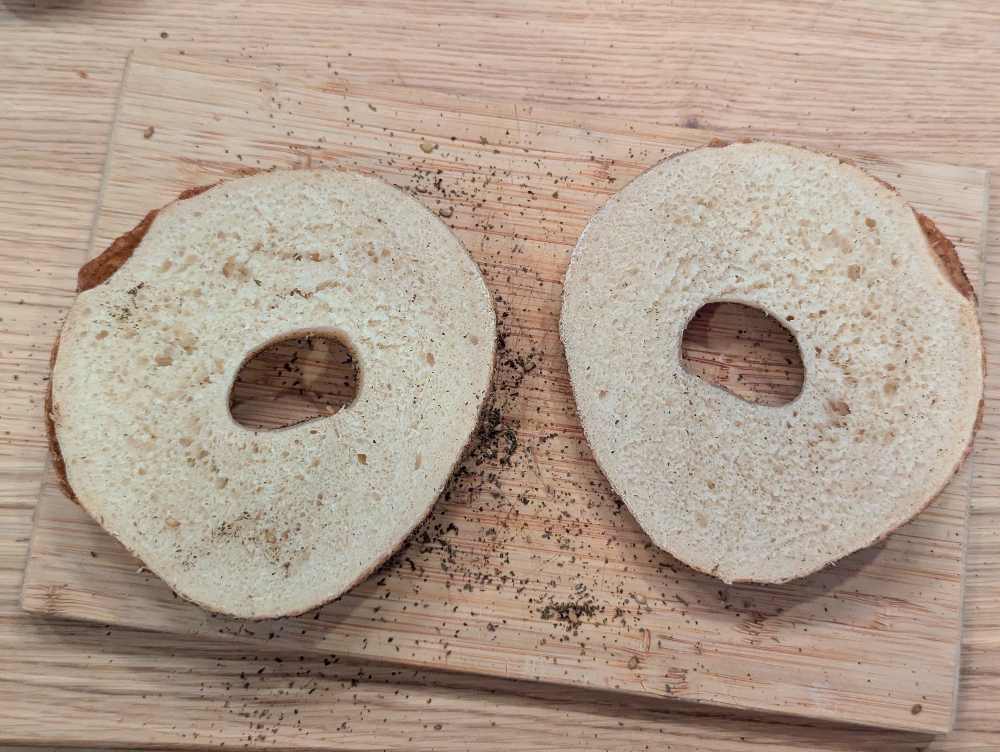
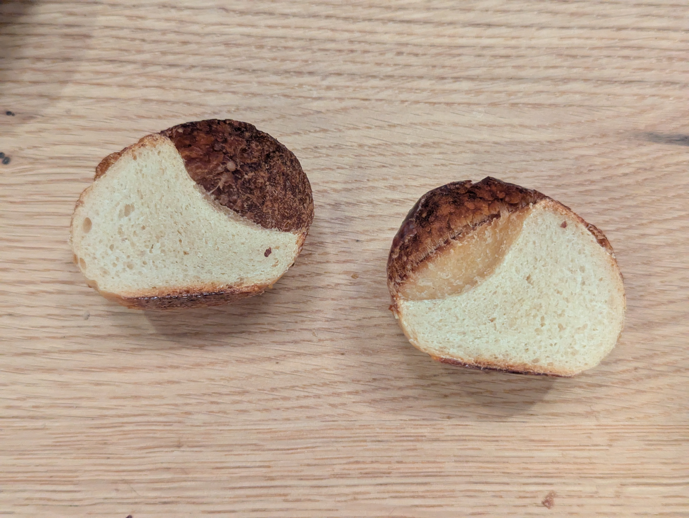

As I have learned more about controlling yeast to time cold ferments I have been wanting to test a longer ferment timeline. My patience has been the only thing really getting in my way. Longer ferments have shown themselves to provide more flavor, but I wonder where that stops paying off. This batch goes to 60 hours.

## What I did
The only variable being tested here is time. Everything else is my usual formula. The yeast quantity comes from the scheduling calculation I've been working with, which sets the yeast inversely to the length of the retard so the population is still productive at the end rather than exhausted partway through. At 60 hours in a 3C fridge that works out to a bit over a quarter of a percent, which is the smallest amount of yeast I've used in any batch so far.

The goal was to have the bagels ready for boiling straight out of the fridge.

**As weights:**
- 385 g bread flour
- 15 g vital wheat gluten
- 20 g barley malt syrup
- 6 g salt
- 1.1 g instant yeast
- 220 g cold water

**As baker percentages:**
- 96.17% bread flour
- 3.83% vital wheat gluten
- 5% barley malt syrup
- 1.5% salt
- 0.27% instant yeast
- 55% cold water

### Stage 1
1. Mix flour and vital wheat gluten in mixing bowl
2. Dissolve barley malt syrup in cold water
3. Add wet ingredients to dry and mix until just combined
4. Add salt and instant yeast
5. Knead dough
6. Divide dough and let rest 5 minutes
7. Shape dough into bagels using the rope rolling method
8. Place into fridge for cold ferment, 60 hours

### Stage 2
9. Remove bagels from fridge so they can get to room temperature
10. Preheat oven to 450F
11. Create water bath with a ratio of 1 L water to 1 Tbsp barley malt syrup
12. Boil each bagel 15-25 seconds per side
13. Bake 6 minutes on bagel boards, then flip
14. Bake another 9 minutes, then rotate baking sheet
15. Bake a final 9 minutes

## How it went
The dough mixed, kneaded, and shaped without any trouble.

The bagels did not end up being ready to boil straight from the fridge as I'd hoped. They had to sit at room temperature for about 45 minutes before just barely passing the float test. That tells me the yeast was set slightly too low for the retard length, since I'm aiming for them to pass within 5 to 15 minutes of coming out.

*Prepared as Plain, Za'atar, Poppy, and Sesame*

## Results
Great flavor in the dough. But I'm not convinced the extra long cold ferment yielded much more than other batches I've done at only 24 to 48 hours. If there's a difference it's small enough that I can't confidently point to it.

*The crumb on the Za'atar bagel looked good! You can see some of the large blistering that occurred at the edges*

I was not a fan of the blistering on this batch. It gave fewer, larger blisters compared to the shorter cold ferments I've done, which produce a finer and more even blistering that I prefer the look of.

*A very large blister formed on one of the small dough ball testers*

I also got the slit-shaped splits that show up in a lot of my batches.

## What I'd change next time
Both the blistering pattern and the splits seem to trace back to the same place - 60 hours of enzymatic activity on the dough surface.

Blisters form when gas collects between the gelatinized skin and the dough underneath, then expands in the oven. 60 hours gives a lot of time for protease to degrade the surface proteins enough that gas can migrate sideways and pool before it lifts. I'm assuming this is what resulted in the fewer and larger blisters I got.

The splits are more likely down to the boil. 15 to 25 seconds is very short, so the gelatinized shell is thin and has little tensile strength. Whatever oven spring is left has to go somewhere and it opens the crust along whatever line is weakest.

- Increase the yeast so I have less time out of the fridge before proofing is complete
- Boil longer, 30 to 40 seconds per side, to build a shell with enough strength to resist splitting. This will cost some oven spring and give a denser crumb, but at 15 to 25 seconds I'm at the extreme end of that tradeoff
- Settle back into the 24 to 48 hour range. The extra time didn't seem to offer any noticeable flavor improvements and may have negatively impacted the dough's structure. 