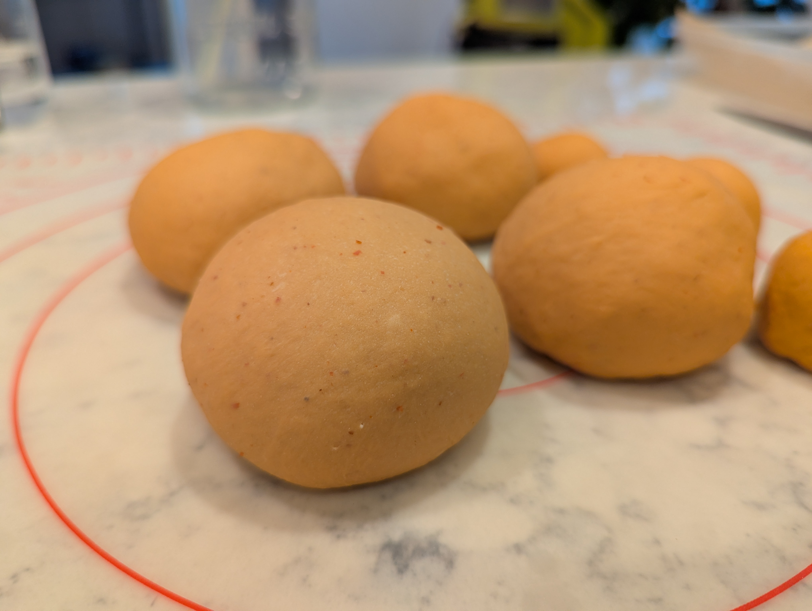
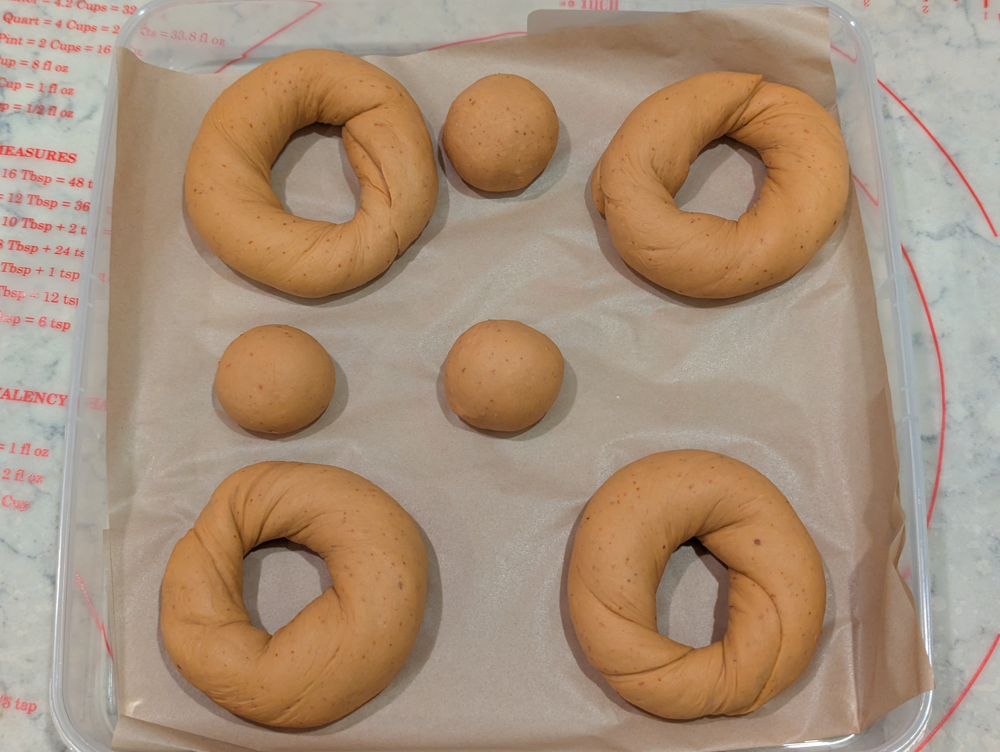
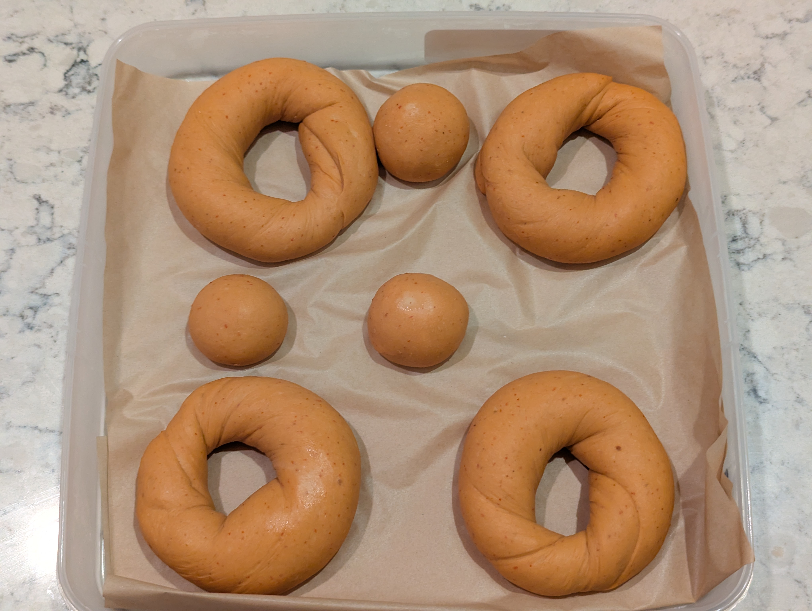
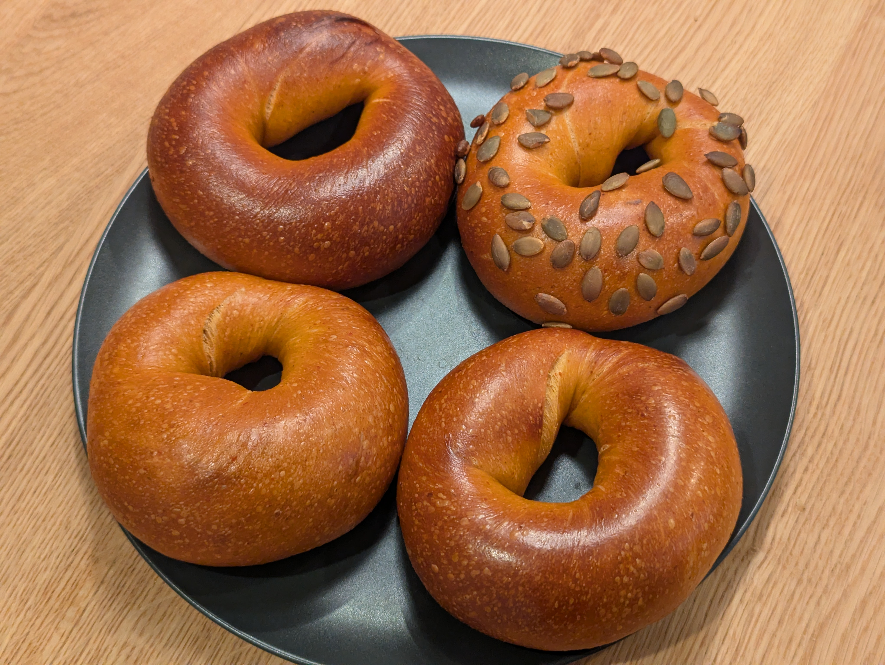
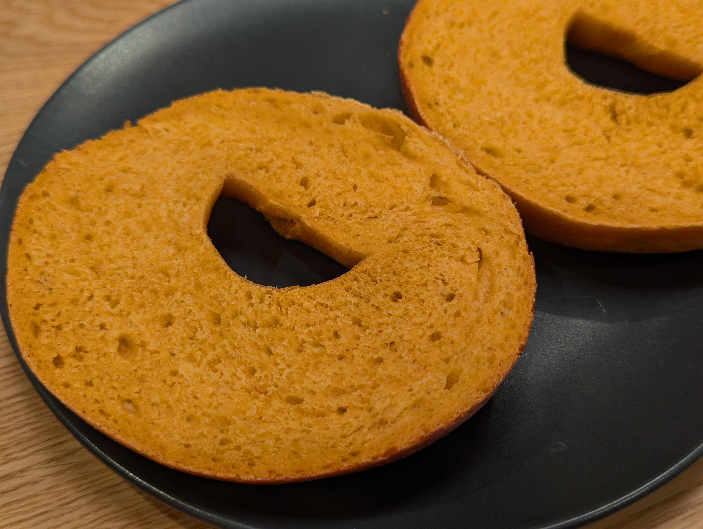
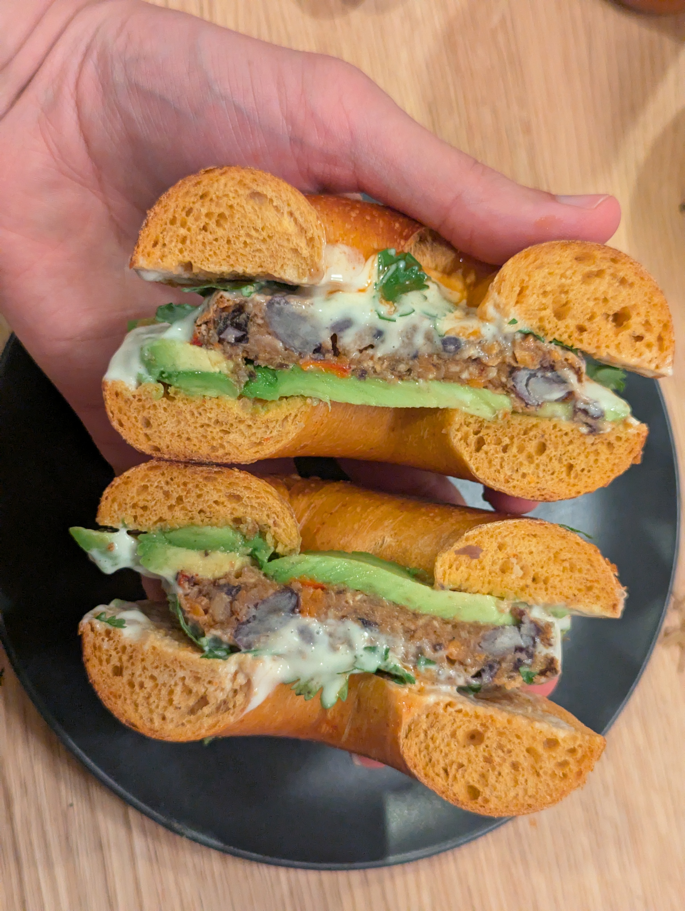

When something is spiced with chipotle peppers I always gravitate to it. I feel shame that when I tried to first make a "spicy" bagel I thought to try buffalo first. Those bagels flopped, so perhaps I can do right by chipotle and have these be a success.

## What I did
The recipe followed close to my recent pattern for 400g flour batches. The big exception being the addition of chipotle peppers in adobo sauce. Water was reduced to compensate for the liquid that would be coming with the peppers and sauce. It was assumed theat the peppers/sauce would be about 75% water so the 50 grams contributed 37.5g water. Since the chipotle pepper flavor is the star of the show here I also decided last minute to sub out barley malt syrup for agave. It felt like the right choice as they are two flavors commonly found together (but really because it means I don't have to worry about buying more barley malt syrup as soon). 

| Ingredient | Baker's Percentage | Measurement (g) |
|---|---|---|
|Bread Flour (12.7% protein) |96.17%|385|
|Vital Wheat Gluten|3.83%|15|
|Instant Yeast|0.95%|3.8|
|Salt|1.50%|6.0|
|Water|47.50%|190|
|Agave Syrup|5.00%|20|
|Chipotle Peppers in Adobo Sauce|12.50%|50*|

*about 3 peppers plus the sauce that clung to them

1. In a blender I combined the water, peppers, syrup, and salt. This was to ensure the peppers were finely broken up and you wouldn't bite into a large chunk when eating a bagel.
2. In the mixing bowl I combined the bread flour and vital wheat gluten.
3. The wet ingredients were added to the dry and mixed for a couple minutes until well combined and the dough was cleanly pulling away from the walls.
4. The yeast was sprinkled over the dough and then the machine kneaded the dough for an additional 8-10 minutes.
5. The dough was removed from the mixer and kneaded by hand briefly before being divided into 130g balls for bagels.
6. The divided balls were allowed to rest for 5 minutes before final shaping with the rope method.
7. The bagels were allowed to sit out of the fridge for 45 minutes before going in the fridge. Since I had many failed experimental flavors before I wanted to ensure that the yeast was active by seeing the bagels begin to proof and increase in size before I invested the fridge time into them.
8. After 24 hours in the fridge the bagels were taken out and allowed to get to room temperature for 10 minutes. They were already passing the float test straight from the fridge but I wanted to make sure the dough wasn't too stiff from being cold.
9. Each bagel was boiled for 30-40 seconds per side in a bath of 1L water-to-1Tbsp Barley Malt Syrup.
10. Baked at 450F for 6 minutes on a bagel board, then flipped off for 9 minutes, and then the baking sheet rotated for another 9 minutes.

As an experiment (and because I couldn't really fit the 4 bagels on the board) I left one off and baked directly on the silicone sheet. The bagel balls are usually left to cook directly on the silicone sheet but I hadn't bothered seeing how a full size bagel does there.

Pepitas were added onto one bagel as a last minute addition since I had seen them as toppings on other bagels online and wanted to give them a shot.

## How it went
Everything went smoothly with this batch. The one thing I might want to keep in mind for next time is that some liquid was lost in the blender. A not insignificant amount of liquid splashed up the walls and clung there which was hard to get out completely to ensure the right hydration of the dough was achieved.

The dough seemed a little dry so rolling and sealing took a bit of patience. I had to give the dough time to rest between each step of dividing, rolling, and sealing ends. 

## Results
I'm very happy with this batch but there is room to improve.
First the positives -  I loved the color of the dough before baking and the interior after baking.
And I was super glad that they successfully proofed. I've had a handful of recent failures when it came to experimental flavors and didn't want to see that trend continue.

Now room to improve - the chipotle flavor was present but didn't shine through as I had hoped. The smoky flavor was there and the burning spice was there, but it felt like the core flavor of chipotle was missing - the tasty spice. I don't think this is as simple as adding more chipotle pepper to the mix, but perhaps requires some additional prep to remove the seeds so you don't also increase the spice too much.

On their own the bagels were delicious, but the flavor got covered up with any toppings - even a simple cream cheese. I ended up enjoying my first bagel of the batch as a sandwich topped with avocado, sour cream, hot sauce, cilantro, and a black bean burger. A great meal, but definitely covered up the chipotle flavor of the bagel.

- Silicone sheet experiment - the bagel without the bagel board time certainly browned on the top and bottom more than the others. Additionally, the bottom of the bagel picked up the light patterning of the silicone sheet where it seems like the starches in the boiling liquid collected and baked on. That is not a great look for the bottom of the bagel.

## What I'd change next time
- Try to increase the chipotle flavor. This may be as simple as adding more peppers into the blender.
- The pepitas were a tasty topping and worked well with the chipotle, however they are large and very prone to falling off. Perhaps they should be chopped smaller.
- Perhaps a shorter bake time. With the dough starting off as orange it was hard to gauge how much time they needed to bake.