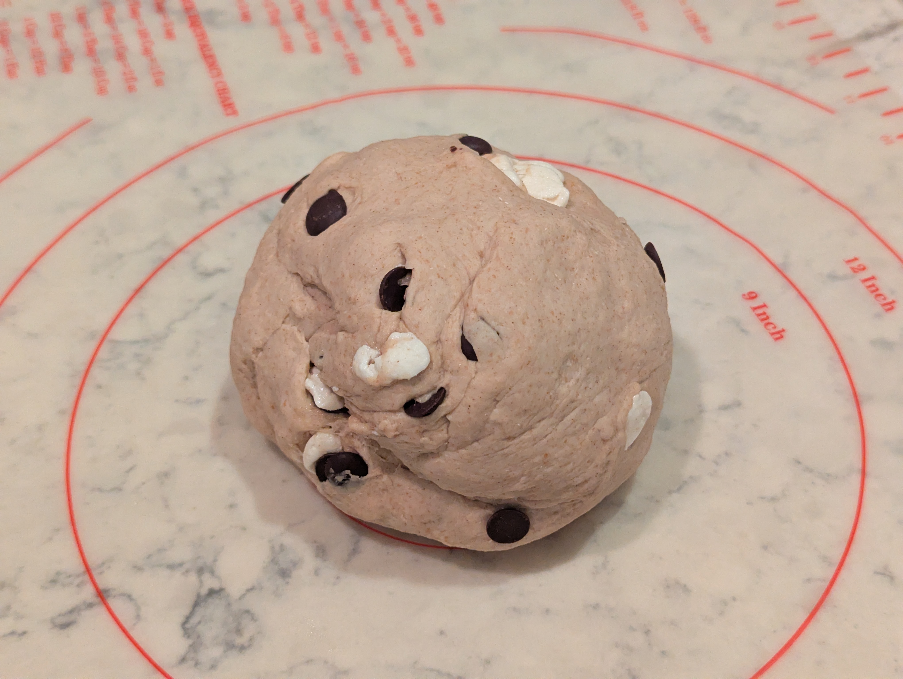
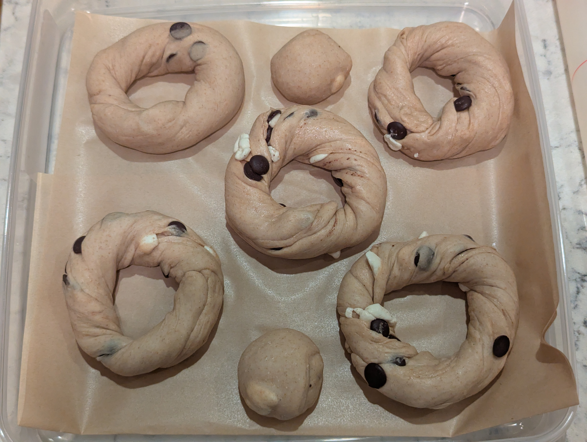
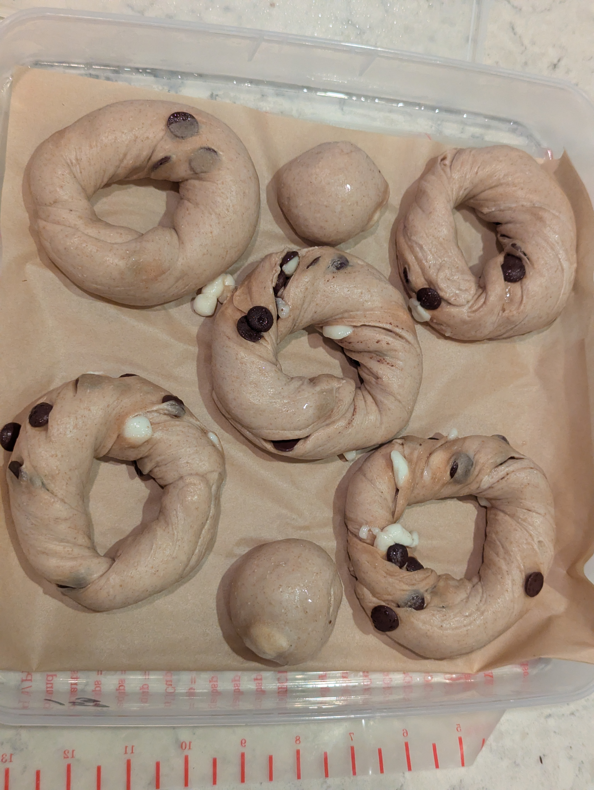
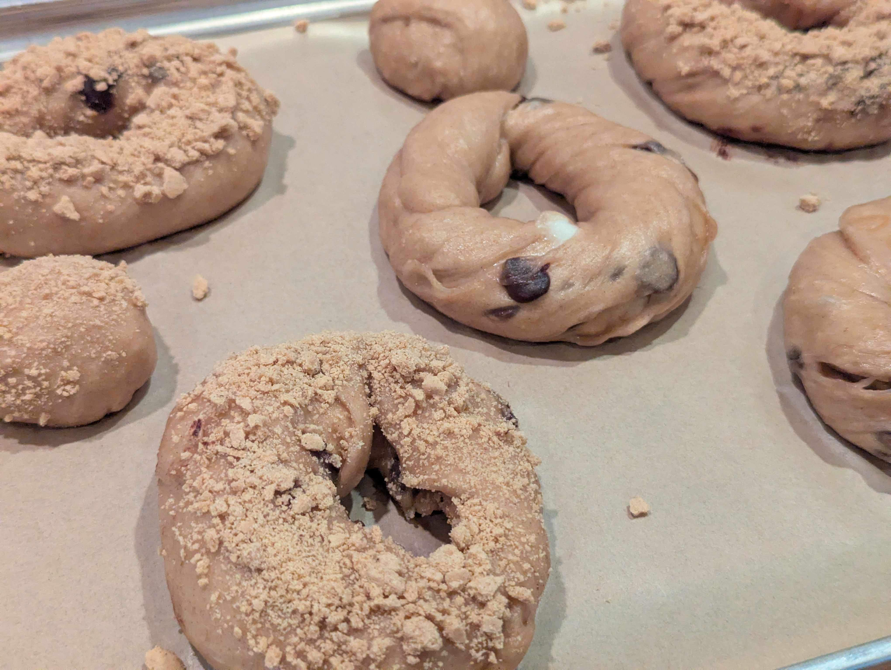
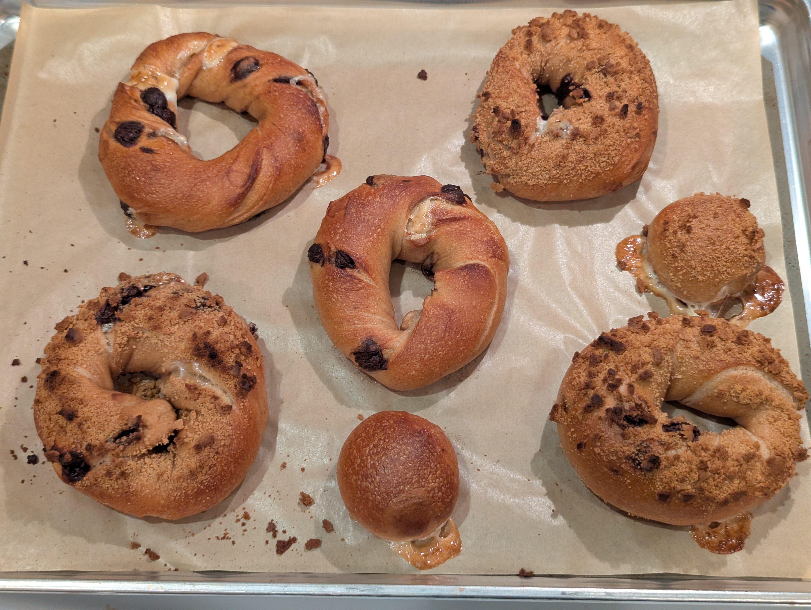
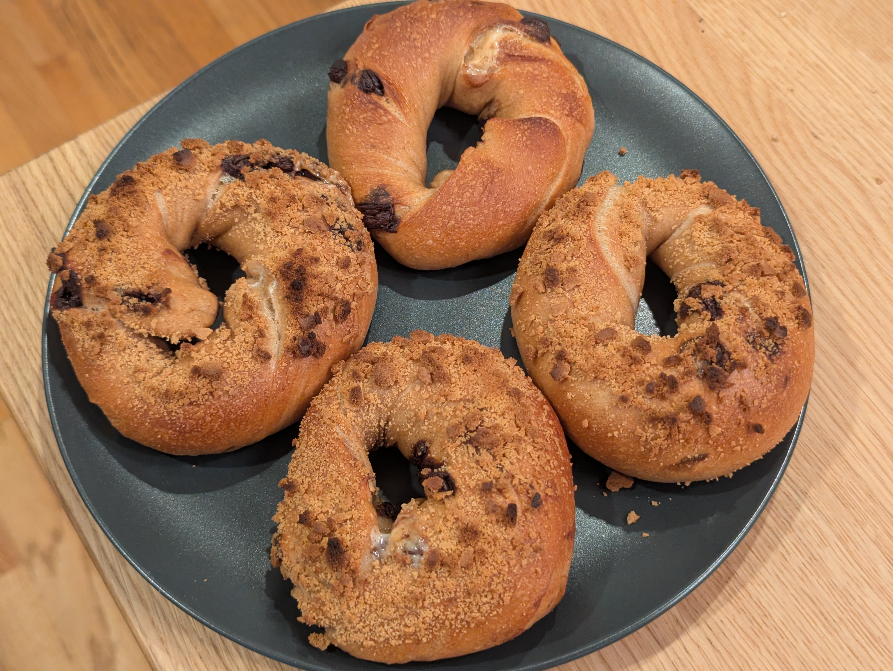
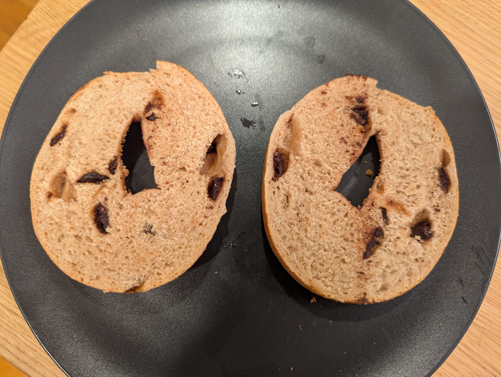

During a family get together we had made plans to have a backyard campfire and roast marshmallows. That never came to fruition but the craving for s'mores remained. 

## What I did
I investigated the common ingredients found in graham crackers and wanted to try to get the bagel dough itself to have some of that character. I didn't want the inclusions and toppings to do all of the work. I saw a pattern that graham crackers are often a combination of whole wheat and white flour so I made that show up in my recipe here along with a smidge of cinnamon and I opted for brown sugar as the sweetener instead of barley malt syrup to have a cleaner flavor.

| Ingredient | Baker's Percentage | Measurement (g) |
|---|---|---|
|Bread Flour (12.7% protein) |85%|340|
|Whole Wheat Flour|15%|60|
|Instant Yeast|0.89%|3.6|
|Salt|1.50%|6.0|
|Water|55.9%|224|
|Dark Brown Sugar|5.00%|20|
|Ground Cinnamon|0.38%|1.5|
|Chocolate Baking Chips (65% Cacao)|15%|60|
|Dandies Mini Marshmallows|7.5%|30|
|Graham Crackers||For Coating|

1. In the mixing bowl I combined the bread flour and whole wheat flour along with 200g of the water until shaggy. This was allowed to autolyze for 25 minutes.
2. The remaining 24g of water was added to a small bowl where I dissolved the salt and brown sugar.
3. The salt/sugar mix and cinnamon was added into the dough and kneaded until fully incorporated.
4. The yeast was sprinkled over the dough and then the machine kneaded the dough for an additional 8-10 minutes.
5. The chocolate chips and mini marshmallows were folded into the dough. The machine wasn't incorporating them well enough so I did this kneading/folding process by hand on the countertop.
6. The dough was divided into 130g balls for bagels.
7. The divided balls were allowed to rest for 5 minutes before final shaping with the rope method and then placed in the fridge.
8. After 24 hours in the fridge the bagels were taken out and allowed to get to room temperature for 10 minutes. They were already passing the float test straight from the fridge but I wanted to make sure the dough wasn't too stiff from being cold.
9. Each bagel was boiled for 25-40 seconds per side in a bath of 1L water-to-1Tbsp Barley Malt Syrup.
10. Some bagels were coated with crushed graham crackers after boiling.
11. Baked at 450F 11 minutes and then the baking sheet was rotated and they were baked for another 11 minutes. Since I wasn't using bagel boards I didn't want their bottoms to burn so I tried a layered approach of using an aluminum baking sheet, a silicone baking mat for additional insulation, and a sheet of parchment paper.

## How it went
No problems mixing the dough but adding the chocolate chips and marshmallows were problematic. I still haven't worked out a technique for inclusions - not that I have done many yet. 
The chocolate chips were okay, but perhaps too large. I was using the Hu brand baking chocolate chips which are fairly wide and flat. They still wanted to fall out of the dough if ever near the outside edges.

The marshmallows presented some new challenges, neither of which I expected. First, the marshmallows deflated. With the kneading they would get squished in the dough. No more fluffy marshmallow pockets as I'd hoped there would be. Second, the longer they were in the dough the more the moisture of the dough started to dissolve the sugars of the marshmallows. Not enough to completely disintegrate the marshmallows, but enough that it made for a stickier dough to work with once shaping was underway.

The inclusions also meant a disrupted gluten network which made rolling and sealing a bit more difficult. Doable but the bagels were not well shaped in the end.

I was nervous about the cinnamon inhibiting yeast like I experienced with my cinnamon raisin bagels, but thankfully that was not a problem here. The bagels were passing the float test straight from the fridge.

## Results
Overall, the bagels were enjoyable but still far from a true smores experience. They ended up eating more like chocolate chip bagels than anything else.

The dough itself didn't have much graham cracker flavor. The graham cracker crumbs on top helped somewhat in the flavor department but only the smallest powdery crumbs stayed in place so there wasn't much left after a single bite.
The chocolate chips were plentiful but a tad too dark. Without the dough itself being sweet the darkness of the chocolate stood out.
There were not enough marshmallows, but I was limited by what I had on hand at the time.  Marshmallows that were exposed at the edges of the dough did melt out of the bagels but they also got some tasty browning. The few bites with marshmallows were the best of the bagels so I'd like to continue trying to go down this route.

## What I'd change next time
- Marshmallows needed to be more present
	- This could be done with simply more marshmallows - perhaps twice as many
	- Perhaps topping the bagels with marshmallows is the simpler way to go. Or since they will melt anyway, perhaps a marshmallow fluff topping instead.
		- A marshmallow fluff could always be applied after the bake too, and torched to get the charred flavor
	- Instead of mixing the marshmallows into the dough, perhaps these would be suited for a "stuffed" bagel shaping. By rolling out the dough then creating a row of mini marshmallows that you can wrap and roll the dough around. This way you could get a core of marshmallow all around the bagel.
- The bagel dough flavor needs to be more like a graham cracker
	- Perhaps using Graham flour instead of typical whole wheat flour. And increasing the percentage of either variation of whole wheat flour. If I go this route I should consider vital wheat gluten to keep a strong gluten network.
		- The whole wheat flour could be dry toasted beforehand too to help develop the toasted cracker flavor (heat denatures gluten though, so more vital wheat gluten would be needed)
	- I should try increasing the sweetener to try and have the base dough be sweeter itself instead of relying solely on the chocolate and marshmallows. Additionally, I could increase the flavor complexity by using molasses in addition to the brown sugar
	- I could consider mixing crushed graham crackers directly into the dough instead of whole wheat flour
- Graham cracker crust coating could be viable but I needed to make more of it and perhaps finer crumbs so that more could stick and I could get a full bagel coating instead of just the top side
- Another experimental idea for tackling the marshmallow and graham cracker crumb shortage is to create a "rice crispy treat" sheet of them. Mix the melted marshmallows and graham cracker crumbs then spread thin to cool. Then sections can be cut out that would be sheets to lay on top of the bagels before or in the middle of baking so that the marshmallows remelt and coat the bagels. Similar to how a slice of cheese would behave.